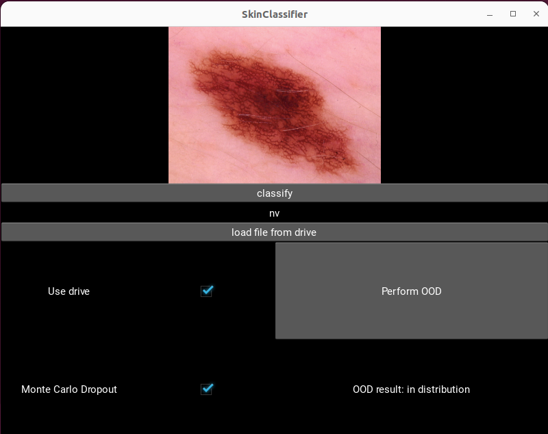

# Skin Classifier App
This repository hosts a Skin Classifier App built on the Kaggle [HAM10000](https://www.kaggle.com/datasets/kmader/skin-cancer-mnist-ham10000) Dataset. The app utilizes the deep CNN ResNet50 model to classify uploaded images into various skin lesion classes. Furthermore, Monte Carlo Dropout enhances prediction accuracy, and an out-of-distribution (OOD) detection method based on Mahalanobis distance, as described in the paper [Distance-based detection of out-of-distribution silent failures for Covid-19 lung lesion segmentation](https://www.sciencedirect.com/science/article/pii/S1361841522002298) by Camila González et al., is also implemented.

| Label  | Full Name |
| ------------- | ------------- |
| akiec  | Actinic keratoses and intraepithelial carcinomae  |
| bcc  | basal cell carcinoma  |
| bkl  | benign keratosis-like lesions  |
| df | dermatofibroma  |
| nv  | melanocytic nevi  |
| vasc  | pyogenic granulomas and hemorrhage  |
| mel | melanoma  |

Image:

### App
The implementation of the app is located in the [`APP Skin Classifier folder`](App Skin Classifier)[`APP Skin Classifier folder`](App%20Skin%20Classifier/). It is written in Python using the kivy library. It can be migrated to an Android app using Buildozer. A notebook is provided. The app utilizes a pre-trained model generated by the accompanying notebook. By using the provided backup file [`environment_backup_app.txt`](App%20Skin%20Classifier/environment_backup_app.txt), a conda environment can be set up to execute the app via [`main.py`](App%20Skin%20Classifier/main.py) .

### Data Script

The preprocessing, training, validation, Monte Carlo dropout, OOD, etc. can be found in the jupyter notebook OOD2 which can be run with collab. However, the Datasets (HAM10000) must be downloaded and placed in the Google Drive for access. 

